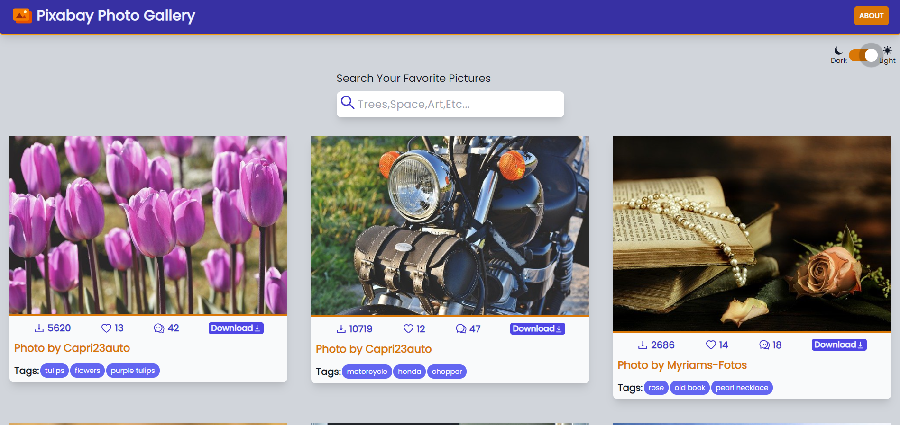

### Pixabay Picture Gallery

Pixabay Picture Gallery makes use of the **Pixabay API** to showcase trending pictures hosted on their website. It also has **search functionality**, which will display photos related to the tag you searched. And it also comes with **Dark Mode**. User can **switch between Light Mode and Dark Mode**.
The website is created using **React JS Library** and **Tailwind CSS** Framework.

Link to Live Website: [Pixabay Picture Gallery](https://pixabay-photo-gallery.netlify.app/)

To run this project locally, make sure you have npm installed.

In the project directory, you can run:

`npm install`  
`npm start`
